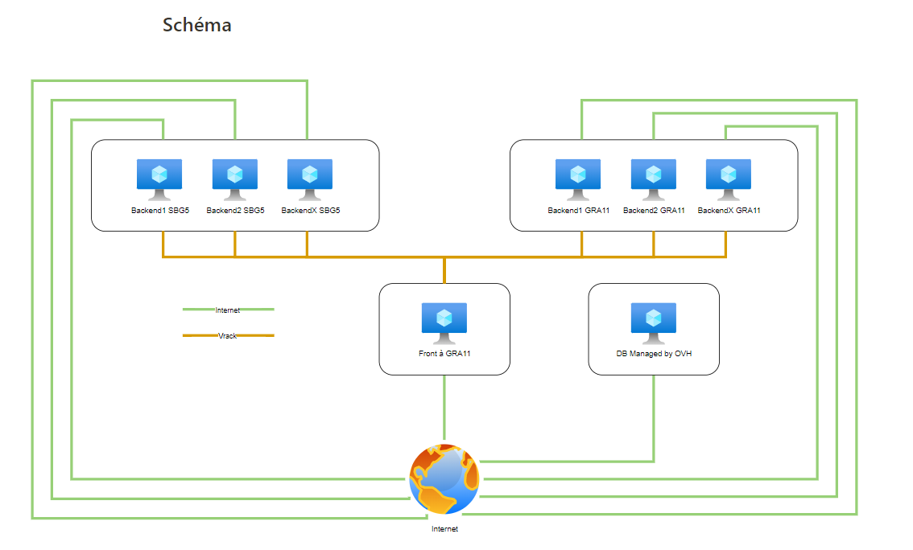
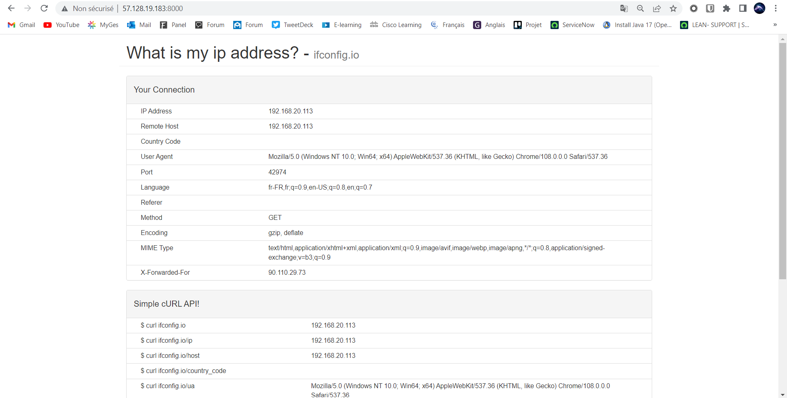

# Présentation du projet Linux - Eductive20

### Objectif du Projet

- Obtenir un site WordPress de haute disponibilité
- Déploiement sur deux DataCenters d'OVH (GRA11 & SBG5)
- Utilisation de Terraform pour générer nos instances
- Utilisation d'Ansible pour automatiser le déploiement des configurations
- Utilisation de Docker-compose pour déployer des services

### Résultat attendu



# Installation

### Pré-requis

- Terraform
- Ansible
- Un fournisseur Cloud permettant de créer des instance (OVHCLoud par exemple : https://www.grottedubarbu.fr/ovh-api-openstack/)
- Une paire de clé SSH (Public & Private)

# Inventaire des fichiers

> Dossier Terraform

- infra.tf : Configuration des instances
- inventory.tmpl : Configuration du fichier inventory.yml utilisable par Ansible
- providers.tf : Utilisation du fournisseur de Cloud OVH
- variables.tf : Utilisation des variables pour infra.tf

> Dossier Ansible
- deploy-infra.yml : Déploiement des configurations pour l'infrastructure

  > Dossier templates

    Liste des différents services
 
    > Dossier HaProxy
    - haproxy.cfg : Configuration haproxy
    > Dossier web
    - index.html : site web à déployer sur les instants backends
	> Dossier NFS
	- nfs.j2 : Contient la configuration du NFS
    > Dossier ifconfig.io
    - docker-compose.yml : Déploiement du conteneur ifconfig.io
    > Dossier wordpress
    - docker-compose.yml : Déploiement du conteneur Wordpress

### Vérification de la syntaxe des fichiers

Vérification des fichiers Terraform :

> tflint infra.tf

Vérification des fichiers Ansible

> yamllint deploy-infra.yml

# Installation

### Connexion au fournisseur Cloud (OVH)

Executer la commande suivante :

> source ~/openrc.sh

### Déploiement des instances via Terraform

- Se rendre dans le dossier "Terraform"
```
cd projet/terraform
```

- Initialiser Terraform
```
terraform init
```

- Vérifier les modifications à effectuer
```
terraform plan
```
- Lancer l'execution
```
terraform apply
>>> yes
```
- Vérifier le déploiement des instances
```
terraform show
```

# Déploiement des configurations via Ansible

- Changer de dossier
```
cd ../ansible
```

- Vérfifier que le fichier inventory.yml est conforme
```
cat inventory.yml
yamllint inventory.yml
```

Déployer les configurations
```
ansible-playbook deploy-infra.yml --ssh-common-args='-o StrictHostKeyChecking=no'
```

# Firewall

- Le Vrack est en "Open bar" ; tout le reste est bloqué.
- L'instance FrontEnd possède les ports suivants ouvert :
  - 22 : SSH
  - 53 : DNS
  - 80 : NGINX (IP public)
  - 81 : NGINX (IP privée)
  - 82 : Wordpress
  - 8000 : ifconfig.io
  - 8080 : Statistiques

# Scalabilité

Le projet permet de créer autant d'instance Backend que nous souhaitons. En effet, il suffit de modifier la variable "nombre_instance_backend" dans variables.tf

```
# Nombre d'instance Backend
variable "nombre_instance_backend" {
   type = number
   default = 3 #Définir le nombre, on peut par exemple en mettre 10.
}
```

# Accéder aux différents services
```
cat inventory.yml
```
Récupérer l'IP frondent, puis y accéder dans votre navigateur internet :
```
https://votre_ip_frontend:80 - Accès nginx1
https://votre_ip_frontend:81 : Accès nginx2
https://votre_ip_frontend:82 : Accès backend Wordpress
https://votre_ip_frontend:8000 : Accès ifconfig.io
https://votre_ip_frontend:8080 : Accès aux statistiques de HaProxy
```

# Résultat final

### Port 80 - Nginx


### Port 81 - Nginx


### Port 82 - Wordpress


### Port 8080 - Statistiques HaProxy


### Port 8000 - Ifconfig.io


